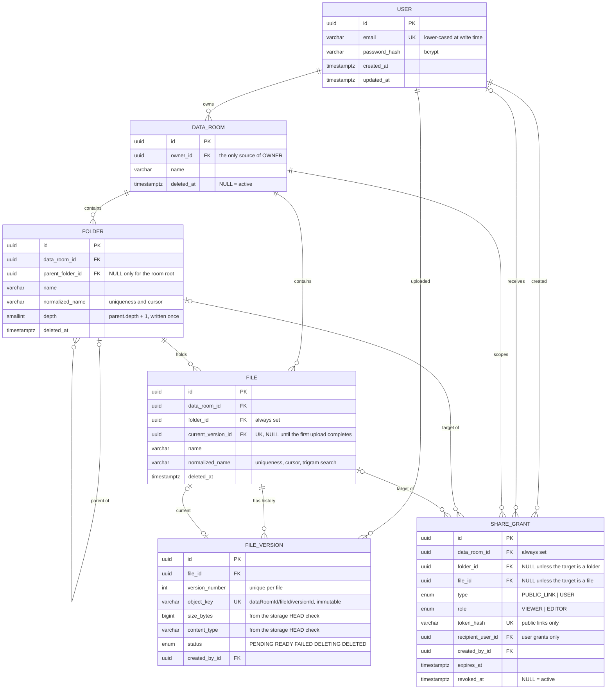

# Data Room

A secure document repository: nested folders, versioned PDF uploads, in-browser viewing, and
read-only sharing by public link or per-user grant.

React SPA + Express API + PostgreSQL + private blob storage, deployed as two projects from a
single repository.

## Contents

- [Live](#live)
- [What is implemented](#what-is-implemented)
- [Stack](#stack)
- [Getting started](#getting-started)
- [Repository layout](#repository-layout)
- [Architecture](#architecture)
- [Data model](#data-model)
- [Design decisions](#design-decisions)
- [How it scales](#how-it-scales)
  - [Size and item count of a folder subtree](#size-and-item-count-of-a-folder-subtree)
  - [What changes at 100,000 files](#what-changes-at-100000-files)
  - [Adding per-user roles](#adding-per-user-roles)
- [Groundwork already in place](#groundwork-already-in-place)
- [How this was verified](#how-this-was-verified)
- [Known gaps](#known-gaps)
- [Use of AI](#use-of-ai)

## Live

|            | URL                                       |
| ---------- | ----------------------------------------- |
| Web        | https://data-room-app-api-qd45.vercel.app |
| API        | https://data-room-app-api.vercel.app      |
| Repository | https://github.com/LesiaUKR/data-room-app |

The browser only talks to the web origin. The web project forwards `/api/:path*` to the API
deployment, so `https://<web>/api/health` and `https://<api>/health` return the same response.

## What is implemented

Everything below works end to end against a real PostgreSQL database and a real private blob
store. There are no mocks and no stubbed endpoints. The interface shows nothing that is not
implemented: no disabled buttons, no placeholder menus.

**Accounts**

- Sign up, sign in, sign out.
- Sign-up creates the user's data room and its root folder in one transaction, so a file always
  has a folder to live in.
- The session is a JWT in an `HttpOnly` cookie.
- Open a deep link without a session, and you land back on that page after signing in.

**Folders**

- Create folders and nest them as deep as the limit allows.
- Rename in place, and move around with breadcrumbs.
- Delete a folder together with everything inside it.
- The delete dialog shows what will be lost: how many folders, how many files, and the total
  size. One recursive query returns all three numbers.

**Files**

- Drag and drop several PDFs at once, with progress for each file.
- Open a document in the browser, rename it, move it to another folder, or delete it.
- Upload a name that already exists, and the app stores a new **version** of that document
  instead of a duplicate or a `(1)` suffix.
- The table shows which version is current.

**Sharing**

- Share a data room, a folder, or a single file.
- A public link works for anyone who opens it, even signed out.
- A user grant works only for one registered account.
- Access is read-only, and it is inherited: a grant on a folder covers everything inside it and
  nothing next to it.
- The owner sees every active grant and can revoke any of them. After a revoke, the link stops
  working right away.

**States**

- Every screen handles loading, empty, forbidden, deleted, offline, and broken-link cases.
- Delete a shared folder while a reader has it open, and the reader sees a calm empty state
  instead of a crash.

## Stack

| Layer    | Choice                                                                                    |
| -------- | ----------------------------------------------------------------------------------------- |
| Frontend | React 18, Vite, TypeScript, Tailwind, shadcn/ui on Radix, TanStack Query / Router / Table |
| Contract | ts-rest + zod, shared by both apps as a workspace package                                 |
| Backend  | Express 4, TypeScript, layered feature modules with manual dependency injection           |
| Data     | PostgreSQL (Neon) with Prisma                                                             |
| Storage  | Vercel Blob, private store, browser-direct uploads through short-lived signed URLs        |
| Auth     | Email and password, JWT in an HttpOnly cookie                                             |
| Hosting  | Two Vercel projects from one repository                                                   |

## Getting started

### Prerequisites

- **Node.js 24 LTS.** The range is pinned in `engines` (`>=24 <25`). Another major version fails
  right away instead of failing later in a confusing way.
- **npm 11**, which comes with Node 24.
- **A PostgreSQL database.** This project uses Neon, and the setup below expects its two
  connection strings. Any PostgreSQL 14+ works if you point both variables at it.
- **A Vercel Blob store, created as private.** You choose the access mode once, at creation, and
  you cannot change it later. A public store is not access control for private documents.

### Setup

**1. Install.** The shared contracts package builds itself through its own `prepare` script, so
this step also produces the types both apps import.

```bash
git clone https://github.com/LesiaUKR/data-room-app.git
cd data-room-app
npm install
```

**2. Configure.** Each variable is explained inside the example file.

```bash
cp apps/api/.env.example apps/api/.env
```

| Variable                | Required | Notes                                                                                                                            |
| ----------------------- | -------- | -------------------------------------------------------------------------------------------------------------------------------- |
| `DATABASE_URL`          | yes      | Pooled endpoint (the `-pooler` host on Neon). The API uses it at runtime.                                                        |
| `DIRECT_URL`            | yes      | Unpooled endpoint, used **only** by Prisma Migrate. DDL cannot run through a pooler, and the config rejects a pooled value here. |
| `JWT_SECRET`            | yes      | At least 32 characters. The example placeholder is rejected, so an unedited file cannot start the API.                           |
| `BLOB_READ_WRITE_TOKEN` | yes      | Server-side only. The browser gets short-lived signed URLs instead.                                                              |
| `PORT`                  | no       | Defaults to `3001`, which is the port the Vite proxy expects.                                                                    |
| `LOG_LEVEL`             | no       | Defaults to `info`.                                                                                                              |
| `SEED_PASSWORD`         | no       | Only for `npm run db:seed`. It must follow the same rules as a sign-up password.                                                 |

Generate a real signing key:

```bash
node -e "console.log(require('node:crypto').randomBytes(48).toString('base64url'))"
```

The API checks all of this with zod at startup and refuses to boot on a bad value. A missing
variable shows up at once, not as a 500 three screens into a demo.

**3. Create the schema.** This applies the migrations, which include hand-written partial
indexes, `CHECK` constraints, and the `pg_trgm` extension. It also generates the Prisma client,
which is not committed to the repository.

```bash
npm run db:migrate --workspace apps/api
```

If the database is already migrated and you only need the client, run
`npm run db:generate --workspace apps/api` instead. If you skip both, the API cannot load its
database module.

**4. Seed two accounts (optional)**, so you have someone to share with. Needs `SEED_PASSWORD`.

```bash
npm run db:seed --workspace apps/api
```

**5. Start both halves** in two terminals. Start the API first, because the proxy expects it on
that port.

```bash
npm run dev --workspace apps/api    # http://localhost:3001
npm run dev --workspace apps/web    # http://localhost:5173
```

Open http://localhost:5173. Vite forwards `/api` to the API and removes the prefix, exactly like
the production rewrite. So the session cookie is first-party in development too, and the client
needs no CORS setup at all.

### Commands

Run these from the repository root, unless a workspace is named.

| Command                                    | What it does                                                               |
| ------------------------------------------ | -------------------------------------------------------------------------- |
| `npm run build`                            | Builds the contracts package, then every workspace that has a build script |
| `npm run typecheck`                        | Type-checks every workspace                                                |
| `npm run lint`                             | Lints the repository                                                       |
| `npm run format`                           | Applies the shared formatting rules                                        |
| `npm run format:check`                     | Checks formatting without writing, which is what the pre-commit hook runs  |
| `npm run dev --workspace apps/api`         | API with reload on change                                                  |
| `npm run dev --workspace apps/web`         | SPA dev server with the `/api` proxy                                       |
| `npm run db:generate --workspace apps/api` | Generates the Prisma client, which is not committed                        |
| `npm run db:migrate --workspace apps/api`  | Creates and applies a migration, then regenerates the client               |
| `npm run db:seed --workspace apps/api`     | Seeds two development accounts                                             |
| `npm run db:reset --workspace apps/api`    | Drops the database and rebuilds it from the migrations                     |
| `npm run db:studio --workspace apps/api`   | Opens Prisma Studio against the configured database                        |

A pre-commit hook checks staged files with ESLint and Prettier, then type-checks the whole
repository. It never rewrites files. A commit that does not lint, does not match the formatting
rules, or does not compile is rejected.

## Repository layout

```text
apps/web/            React single-page application
apps/api/            Express API, Prisma schema and migrations
packages/contracts/  Route definitions, schemas, and shared enums used by both
assets/              Data model reference
```

`packages/contracts` builds before both apps, because they import its output and not its source.
Inside each app the split is the same: shared infrastructure in one place, and one folder per
feature (`auth`, `data-rooms`, `folders`, `files`, `shares`). You can follow a request from
either end and land in the matching folder.

## Architecture

A request follows one path, and each layer has one job:

```text
browser → contract-typed client → /api rewrite → Express
        → middleware → controller → service → repository → PostgreSQL
```

Handlers only deal with HTTP. Services hold the business rules and never touch `req` or `res`.
Repositories are the only place that talks to the database. Whatever leaves a service is a
shaped DTO, never a raw database row.

Express was chosen to fit the time budget, not as an architectural preference. The structure is
the one NestJS produces: one composition root per feature module, constructor injection,
validation declared in the contract, and one error filter. So the same decisions move to Nest
without rework.

### Two entry points, one application

`src/app.ts` builds the Express app and exports it. It knows nothing about how it will run.
`src/server.ts` adds `listen` and graceful shutdown for local development. On Vercel the same
exported app becomes a single function, because a serverless runtime has no long-running process
that owns a port. Graceful shutdown is therefore a documented no-op in production. It is not dead
code: the same file also has to work as a normal server.

### Deployment

Two Vercel projects deploy from one repository, with root directories `apps/api` and `apps/web`.
The web project forwards `/api/:path*` to the API **before** its single-page-app catch-all rule.
That order matters. API calls reach the API, and a reloaded deep link still gets `index.html`
instead of a 404. If you swap the two rules, the app swallows its own API traffic.

Keeping both halves on one origin is a security choice, not a convenience. The session cookie
stays `HttpOnly`, and the client needs no CORS setup and no credentials handling. Local
development works the same way through the Vite proxy.

Because both apps live in one repository, Vercel only rebuilds a project when files under its
root directory change. A commit that touches only `apps/web` leaves the API deployment on the
previous commit, and that is correct. A change in `packages/contracts` affects both, so make sure
both projects redeploy in that case.

## Data model



The full reference is in [`assets/data-model-erd.md`](assets/data-model-erd.md): every
constraint, every index, the cascade rules, and the query each index serves.

Five decisions do most of the work:

**1. Every data room owns a root folder**, created with the room in the same transaction.

- A file always has a `folderId`, and every folder a user can see has a parent.
- This removes the `NULL` case from listing, uniqueness, and permission queries.
- The room stores no `rootFolderId` column: two required foreign keys pointing at each other
  cannot both be inserted first. The root is found by `parent_folder_id IS NULL`, and a partial
  index makes sure there is only one.

**2. The tree is an adjacency list, with a `depth` that is written once.**

- One `WITH RECURSIVE` query answers subtree questions and returns folder count, file count, and
  total size together, which is what the delete dialog needs.
- The frequent query is the walk _up_ the tree, for permissions and breadcrumbs. It is limited by
  depth and cheap. Subtree totals run only when asked for.
- Moving a folder is out of scope in the brief, and that is what keeps `depth` correct: nothing
  ever has to rewrite the depth of children.

**3. A logical `File` is separate from an immutable `FileVersion`.**

- The file holds the name, the folder, and the deleted flag.
- The version holds the storage key, size, content type, and state.
- Renaming or moving a document changes metadata only, because the storage key is
  `dataRoomId/fileId/versionId` and never contains the display name.
- Uploading an existing name adds the next version instead of a second row.

**4. Names are unique per folder in the database, not in a service check.**

- Partial unique indexes skip soft-deleted rows, so a deleted name can be used again.
- The index is also what holds when two uploads arrive at the same moment.
- The result depends on what the user meant: uploading an existing name creates a version, while
  renaming or moving onto a taken name returns `409`. Quietly merging two documents would destroy
  one of them.

**5. Sharing is one table with real foreign keys**, not a `(type, id)` pair.

- PostgreSQL enforces the references and the cascades, so a deleted folder cannot leave a grant
  pointing at nothing.
- `OWNER` comes from `DataRoom.ownerId` and is never stored as a grant.
- Public-link tokens are stored as a hash. The raw token only exists in the URL the owner copies.

## Design decisions

**The contract is a compile-time dependency, not documentation.**

- Routes, schemas, and error codes live in one workspace package that both apps import.
- Rename a field and both apps fail to type-check, so the mismatch appears in a build instead of
  in a user's browser.
- Cost: the package must build first, which its `prepare` script handles.

**One origin instead of CORS.**

- The web project forwards `/api/*` to the API, so the browser sees a single origin.
- The session cookie can stay `HttpOnly`, and the client has no CORS or credentials code at all.
- Cost: one rewrite rule whose order matters, plus preview deployments of the web app that point
  at the production API.

**One error shape, built in one place.**

- Every failure returns `{ error: { code, message, details? } }`.
- Services throw, and one middleware turns the throw into a status.
- Clients check `code`, never the wording.
- Schema validation returns **422**. Input that breaks before a schema can run, such as invalid
  JSON, returns **400**. Anything unexpected returns a plain 500 with a request id and no internal
  details.

**Redaction lives inside the logger.**

- A public-link token travels in the URL, so the request logger records the route template and not
  the URL.
- The logger walks plain-object payloads and replaces any key that looks like a credential, at any
  depth.
- It strips signed-URL queries and database credentials out of strings.
- It reduces an error to type, message, and stack. That last part matters: libraries attach extra
  data to errors, and a failed JSON parse carries the raw request body.
- No call site can forget to redact, because no call site does it.

**Uploads bypass the API.**

- A serverless function accepts at most 4.5 MB of request body, so file bytes never pass through
  Express.
- The API creates the version row first, then gives the browser a short-lived URL signed for one
  path and one operation. The browser writes straight to blob storage.
- The upload uses `XMLHttpRequest` instead of `fetch`, because `fetch` cannot report upload
  progress and the brief asks for a progress bar per file.

One test against the real store settled a question early:

- A URL signed for `application/pdf` accepted a `text/plain` body and overwrote the object. So the
  content type inside a signature is a hint, not a guarantee.
- The size limit in the same signature was not verified separately, so it is treated the same way.
- Both are checked after the upload instead. The API asks storage for the real size and content
  type of the object and stores those, never the values the client claimed.
- A version becomes readable only after that check passes.

**The version lifecycle is an explicit state machine**, because the database and storage do not
share a transaction.

- States go `PENDING → READY | FAILED | DELETING`, then `DELETING → DELETED`.
- Completing an upload is safe to repeat.
- It cannot bring back a version that is already being deleted.
- It moves the current-version pointer only to a _newer_ version, so a late second upload cannot
  turn a document back to an older state.
- An upload that stops halfway leaves a `PENDING` row, which is easy to find later, instead of an
  invisible orphan object in storage.

**Authorization is one policy object, not a check in every endpoint.**

- Every protected read and write calls `accessPolicy.require({ principal, action, resource })`.
- The policy works out the effective role in this order: room ownership, a grant on the room, a
  grant on any folder above the resource, a direct grant, or a valid public-link token.
- Ancestors come from one recursive query that is limited by depth.
- Revoked and expired grants are filtered out at the source, so the policy only ever sees active
  rows.
- Ownership checks copied into each endpoint are how a data room leaks data. Here there is exactly
  one place to review.

**A public route and a private route never share a principal.**

- The principal is a union type that the route builds.
- A protected route reads the cookie and never a token. A public route reads the token and never
  the cookie.
- So a signed-in visitor who opens a public link is treated as anonymous, and two separate grants
  can never combine into one role.
- Breadcrumbs on a shared folder are cut on the server at the shared folder, so a reader cannot
  learn the names of folders above it.

**The store is private and cannot be made public later.**

- The access mode is fixed when a Vercel Blob store is created.
- Hard-to-guess URLs are not access control for private documents.
- Verified by testing: an unsigned request for a stored object returns `403`, and a signed one
  returns the bytes.
- Reads are authenticated, and download URLs are created per view and expire in one to five
  minutes.

## How it scales

### Size and item count of a folder subtree

One `WITH RECURSIVE` query, computed in PostgreSQL and never by loading rows into Node:

```sql
WITH RECURSIVE subtree AS (
  SELECT id, 0 AS level FROM folder WHERE id = $1 AND deleted_at IS NULL
  UNION ALL
  SELECT f.id, s.level + 1 FROM folder f
  JOIN subtree s ON f.parent_folder_id = s.id
  WHERE f.deleted_at IS NULL
)
SELECT
  (SELECT COUNT(*) FROM subtree WHERE level > 0)  AS folder_count,
  COUNT(fv.id)                                    AS file_count,
  COALESCE(SUM(fv.size_bytes), 0)                 AS total_bytes
FROM subtree st
LEFT JOIN file fi ON fi.folder_id = st.id AND fi.deleted_at IS NULL
LEFT JOIN file_version fv ON fv.id = fi.current_version_id AND fv.status = 'READY';
```

How to read it:

- All three numbers come back in one round trip, which is what the delete dialog shows.
- `level > 0` keeps the folder out of its own count.
- `file_count` counts documents that have a current `READY` version.
- `total_bytes` adds up only those current versions. Older versions still take space in storage,
  but that is not what a user means by "the size of this folder".

Two details are on purpose:

- `SUM(bigint)` returns `NUMERIC`, which arrives as a string from raw SQL, so the repository
  converts it.
- `size_bytes` is `BIGINT`, which Prisma returns as a JavaScript `BigInt` that `JSON.stringify`
  cannot serialise, so it crosses the API as a decimal string.

This query runs **only when asked for**, never once per row of a listing. Per-row would be the N+1
problem that really hurts at scale.

**Alternatives considered.** How to store a tree was the first decision, and it was made on what
each option makes cheap:

| Option                      | Cheap                   | Expensive                                                   | Verdict                          |
| --------------------------- | ----------------------- | ----------------------------------------------------------- | -------------------------------- |
| **Adjacency list** (chosen) | Insert, move, walk up   | Whole-subtree totals                                        | Fits the real hot path           |
| Materialised path           | Subtree reads by prefix | Every move rewrites descendants                             | Cost lands on writes             |
| Closure table               | Both directions         | An extra row per ancestor pair, kept in sync on every write | Too much machinery for this size |
| `ltree`                     | Subtree queries         | An extension plus a second value to keep correct            | Same, with less standard SQL     |

The deciding fact: the frequent query is the walk **up** the tree, for permissions and
breadcrumbs, and an adjacency list is already good at that. Subtree totals run once, when a user
opens a delete dialog.

**When to change this:**

- If these totals become a measured bottleneck, store counters on the folder and update them in
  the background.
- If queries up and down the tree start to dominate the load, move to a closure table or `ltree`.
- Neither is worth it while the frequent query is the short walk up the tree.

### What changes at 100,000 files

Nothing in the design, because the parts that would have to change were built this way from the
first endpoint. What matters at that size:

**Listings use keyset pagination, never `OFFSET`.** The contents endpoint returns direct children
only, sorted by `(kind_rank, normalized_name, id)`. It asks for one row more than the page to find
out whether another page exists:

```sql
WHERE (kind_rank, normalized_name, id) > ($1, $2, $3)
ORDER BY kind_rank, normalized_name, id
LIMIT 51
```

- `OFFSET` gets slower the deeper you go into a list, and replacing it later would mean rewriting
  every endpoint and every caller.
- The cursor is opaque and encodes those three values.
- Folders and files come from a `UNION ALL`, and each branch uses its own B-tree index.

**A page never returns a total count.**

- `COUNT(*)` over 100,000 rows costs about as much as the page itself.
- You only need that number to draw page numbers, and the interface uses "load more" instead.

**Indexes cover the sort, not only the filter.**

- `folder (data_room_id, parent_folder_id, normalized_name, id)` and
  `file (data_room_id, folder_id, normalized_name, id)` match the `ORDER BY` exactly.
- The `id` at the end keeps the cursor stable when two documents share a name. Without it, a page
  boundary quietly skips or repeats rows.

**Subtree totals never appear per row.** A size or item count next to every folder in a listing
would run one recursive query for every row on the screen.

**PostgreSQL is the catalog, not the blob store.**

- Structure, names, order, and permissions all come from the database. Storage holds bytes only.
- Listing 100,000 objects from a bucket to draw one folder is the failure this avoids.

The first thing you would actually feel is the permission check on deeply nested trees, and that
is limited by a maximum nesting depth rather than by the number of rows.

**Alternatives considered for search.** Search over 100,000 file names was designed even though
the query path is not shipped:

| Option                         | Why not now                                                                                                                                            |
| ------------------------------ | ------------------------------------------------------------------------------------------------------------------------------------------------------ |
| `LIKE '%term%'` with no index  | A full scan of the table on every keystroke                                                                                                            |
| **Trigram GIN index** (chosen) | Real index support for substring matching, one extension, no extra column to maintain                                                                  |
| PostgreSQL full-text search    | Built for whole words and ranking. A user looking for `contract` inside `Acme_contract_v2.pdf` needs substring matching, which full-text does not give |
| A dedicated search service     | A second datastore to deploy and keep in sync, for one text column                                                                                     |

Trigram search also stays correct without extra work, because it indexes `normalized_name`, the
same stored column that already serves uniqueness and the pagination cursor. There is nothing
extra to keep in sync.

**When to change this:**

- If listing latency for one room is measured as too slow even with these indexes, split `file` by
  `data_room_id` or send listing reads to a read replica.
- If substring search is measured as too weak for the amount of data, or users start asking for
  ranking, whole-word matching, or search inside file contents, move search to a dedicated
  service. That is the point where a second datastore starts paying for itself.

### Adding per-user roles

The schema already holds the role. `share_grant.role` has been a `VIEWER | EDITOR` enum since the
first migration, and `OWNER` comes from `DataRoom.ownerId` instead of being stored as a grant. The
MVP only ever _issues_ `VIEWER`, but the column, the enum, and the order
`OWNER > EDITOR > VIEWER` already exist, and the policy already resolves them.

So adding editors is not a migration. It is three changes, and none of them touches the data
model:

1. **The action matrix.** Permissions are a fixed list of actions, such as `file:read`,
   `file:move`, `folder:delete`, and `share:create`. Each action maps to the lowest role allowed to
   do it. To give editors write access, add `EDITOR` to the rows that currently list only `OWNER`.
   Every protected endpoint already goes through `accessPolicy.require()`, so no endpoint has to be
   found and edited.
2. **The sharing UI.** A role selector next to the email field, which sends the role the API schema
   already accepts.
3. **The write paths.** They already receive a resolved role. Today only ownership satisfies them.

The policy picks the _strongest_ role across ownership, room grant, grant on a folder above,
direct grant, and public link. So a person who is a viewer on a room and an editor on one folder
inside it works correctly with no extra rules. The walk up the tree already returns both grants,
and the comparison picks the stronger one.

The partial unique indexes also keep working. One active grant per recipient per target means that
changing someone from viewer to editor updates a row instead of creating a second, competing grant.

**When to change this:** if roles stop being a short fixed list, for example custom roles per
action, groups, or company-wide policies, replace the matrix with a role/permission table and
resolve it inside the same policy object. That is a change in one module, which is exactly why the
policy is an object and not a set of `if` statements spread around the code.

## Groundwork already in place

These things are supported by the schema and the layering, but not shown in the interface, because
the brief marks down half-built features. Each one is a small, contained addition rather than a
redesign.

**Search by file name across a data room.** The `pg_trgm` extension and a partial GIN index on
active file names are in the first migration:

```sql
CREATE EXTENSION IF NOT EXISTS pg_trgm;
CREATE INDEX "file_name_search_idx"
    ON "file" USING GIN ("normalized_name" gin_trgm_ops)
    WHERE "deleted_at" IS NULL;
```

- `normalized_name` is a stored column rather than an expression, so one value serves uniqueness,
  the pagination cursor, and substring matching.
- What is missing is only the query path: a contract route, a repository method, and a search box.
- The authorization rule is already decided. Only a room owner or someone with a room-level grant
  may search the whole room. A folder-level or public-link reader could otherwise learn the names
  of files they were never given.

**Editor roles.** `share_grant.role` already stores `VIEWER | EDITOR`. See the scaling answer
above.

**Grant expiry.** `share_grant.expires_at` exists, and the policy already ignores expired rows.
The API does not accept an expiry when creating a grant yet, so today a grant lasts until it is
revoked.

**Changing the storage provider.**

- Blob storage sits behind a `StorageProvider` interface: `createUploadUrl`, `createDownloadUrl`,
  `head`, `deleteMany`.
- Moving to S3 or R2 means writing a new adapter. No domain code mentions Vercel Blob.
- Password hashing and JWT signing sit behind the same kind of small interface.

**Transactions for multi-step writes.**

- Repository methods accept an optional transaction client, so any flow that must be
  all-or-nothing already runs inside `prisma.$transaction`.
- That covers allocating a version, promoting the current version, deleting a subtree, and
  creating a share.
- Adding a new multi-step flow does not require rewiring the repositories.

## How this was verified

**Static gates**, run on every step and enforced by a pre-commit hook: `typecheck`, `lint`,
`format:check`, `build`. The hook checks staged files and then type-checks the whole repository.
It never rewrites anything, so a commit either passes or is rejected.

**A recorded API check for every endpoint**, run against a real database and real storage rather
than mocks. Each request asserts the status code, the error `code`, and the one thing it exists to
prove. Sharing is the largest part: public links, user grants, inherited access down a subtree,
breadcrumbs cut at the share root, everything a viewer must not be able to do, revocation, and
repeating a revoke.

**Manual checks in the browser and the database** for what an API check cannot see: cookie flags
as the browser reports them, log output with no credentials in it, row counts after a rolled-back
sign-up, and the upload progress bar.

What is missing is unit tests. See the first entry under [Known gaps](#known-gaps).

## Known gaps

These are written down rather than hidden. Each one is a decision with a reason, not an oversight.

- **There is no automated test suite.** A focused set of access-policy tests was planned and cut
  because of the deadline. Verification was static (`typecheck`, `lint`, `format`, `build`), plus a
  recorded manual matrix and API checks run against a real database and real storage. Those show
  how the API behaves, but they do not replace unit tests. This is the first thing to add if the
  project continues.
- **Search across a data room is not available in the interface,** although its index is already
  in place. See the section above.
- **Abandoned uploads are never cleaned up.** A cancelled upload leaves a `PENDING` version row and
  an object that no document points to. The state machine makes them easy to find, for example
  "`PENDING` for more than N hours", but no job runs. The production answer is an outbox table and
  a background worker, which a serverless runtime cannot host as it is.
- **The interface creates one active public link per resource.** The API can hold several, and any
  extra ones created outside the interface are listed and can be revoked. The interface does not
  offer a second link, because two links that differ only by creation time make revoking a guess.
  Naming or fingerprinting links would remove this limit.
- **There is no suggestion list when sharing with a user.** You type the full email address of an
  existing account. Suggesting addresses would need an endpoint that lists registered users, which
  would leak the user directory. The safe version suggests only people the owner has already shared
  with, and it needs its own endpoint.
- **You cannot invite someone who has no account.** A user grant needs a registered recipient. The
  extension point is an `invite_email` column plus claiming the grant at sign-up. Until then a
  public link covers the case, with the known trade-off that a link can be forwarded.
- **Moving a folder is out of scope,** because the brief asks only for moving files. That is what
  keeps `depth` written once. Adding it means rewriting `depth` for the whole moved subtree and
  checking that a folder is not moved into itself.
- **Sessions have no refresh rotation and no server-side revocation list.** One token, about seven
  days, and signing out clears the cookie. The production answer is a short access token plus
  refresh rotation, and it fits entirely inside the auth module.

## Use of AI

AI was used throughout this project, as a working tool rather than a code generator left alone.
Claude Code wrote most of the implementation, and Codex reviewed it.

**Rules and limits were written before the code.**

- A brief analysis, an architecture document that records the reason behind each pattern, and a
  file of hard limits: what must not be modified, bypassed, or added without asking first.
- A defined working format: explain the change, get approval, then write the code. One step at a
  time, with the checks after each step.
- A separate workflow file for each kind of activity: building a feature, debugging, and
  explaining a decision.

**Planning came before implementation.**

- Every non-trivial task started in plan mode. The plan was written and agreed before any file
  changed.
- The work was split into numbered issues, each a vertical slice with its own acceptance
  criteria, so every commit leaves the app deployable.
- Larger issues got their own plan document with the decisions recorded, so a later session could
  not quietly decide them again.

**Review was independent.**

- Codex reviewed finished slices as an outside reader. A different model on purpose, so the
  reviewer was not grading its own work.
- Findings were triaged one at a time, and an accepted correction went back through the same
  explain-then-approve cycle as any other change.
