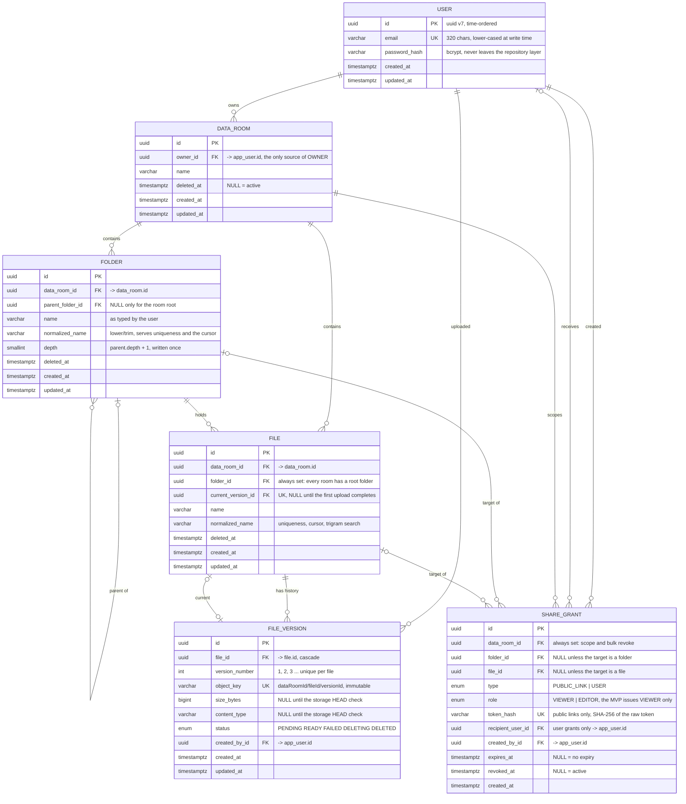
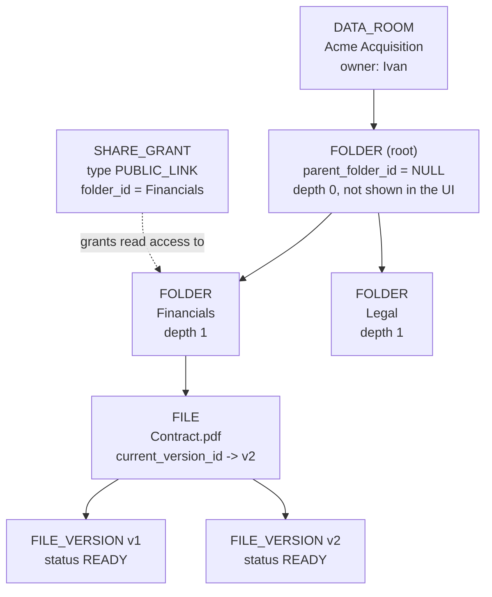

# Data model reference

The diagram and the tables below describe the schema as it is applied, including the SQL that
Prisma Schema cannot express. The authoritative sources are
[`apps/api/prisma/schema.prisma`](../apps/api/prisma/schema.prisma) and the migrations under
[`apps/api/prisma/migrations/`](../apps/api/prisma/migrations/).

## Entity relationship diagram



`USER` is stored as `app_user`: `user` is a reserved SQL keyword, and the hand-written recursive
CTEs stay quote-free without it.

## Reading the relationships

| Relationship                 | In words                                                                     |
| ---------------------------- | ---------------------------------------------------------------------------- |
| `USER \|\|--o{ DATA_ROOM`    | A user may own several rooms; a room has exactly one owner                   |
| `FOLDER \|o--o{ FOLDER`      | A folder may hold subfolders; every folder has a parent except the room root |
| `FOLDER \|\|--o{ FILE`       | A folder holds many files; a file lives in exactly one folder                |
| `FILE \|\|--o{ FILE_VERSION` | The upload history of one document                                           |
| `FILE \|o--o\| FILE_VERSION` | A separate pointer to the version that is current; there may be none yet     |
| `USER \|o--o{ SHARE_GRANT`   | Only a user grant has a recipient; a public link has none                    |
| `FOLDER \|o--o{ SHARE_GRANT` | A grant targets a folder, a file, or the whole room                          |

The optional sides are not notation trivia. Each one encodes a decision: a root folder without a
parent, a public link without a recipient, and a file without a current version until its first
upload succeeds.

## Constraints Prisma Schema cannot express

`CHECK` constraints and `CREATE EXTENSION` have no Prisma equivalent. Partial indexes do, but only
behind the `partialIndexes` preview flag, which this project deliberately avoids. All of it is
hand-written in the migration and reviewed before it runs.

| Rule                                                                  | SQL                                                                                                                                                                             |
| --------------------------------------------------------------------- | ------------------------------------------------------------------------------------------------------------------------------------------------------------------------------- |
| One active file name per folder                                       | `UNIQUE (folder_id, normalized_name) WHERE deleted_at IS NULL`                                                                                                                  |
| One active folder name per parent                                     | `UNIQUE (parent_folder_id, normalized_name) WHERE deleted_at IS NULL`                                                                                                           |
| Exactly one root folder per room                                      | `UNIQUE (data_room_id) WHERE parent_folder_id IS NULL AND deleted_at IS NULL`                                                                                                   |
| A grant targets at most one resource                                  | `CHECK (NOT (folder_id IS NOT NULL AND file_id IS NOT NULL))`                                                                                                                   |
| A link has a token and no recipient; a user grant is the mirror image | `CHECK ((type='PUBLIC_LINK' AND token_hash IS NOT NULL AND recipient_user_id IS NULL) OR (type='USER' AND recipient_user_id IS NOT NULL AND token_hash IS NULL))`               |
| One active user grant per recipient per target                        | three partial uniques on `(data_room_id, recipient_user_id)`, `(folder_id, recipient_user_id)`, `(file_id, recipient_user_id)`, each `WHERE type='USER' AND revoked_at IS NULL` |
| Substring search over active file names                               | `CREATE EXTENSION pg_trgm` + `GIN (normalized_name gin_trgm_ops) WHERE deleted_at IS NULL`                                                                                      |

The root-folder index is not decoration. PostgreSQL treats `NULL`s as distinct, so a unique index
containing a nullable `parent_folder_id` would happily accept two identically named top-level
folders.

The three active-user uniques exist because a repeated grant to the same person must be idempotent
rather than a second row. The service reads an existing grant first; this index is what holds when
two requests race.

## Tenant isolation is a database invariant

Composite foreign keys carry `data_room_id`, so a guessed id cannot create a cross-room relation
even if a service check regresses:

```text
FOLDER      UNIQUE (id, data_room_id)   <- target of the composite references
FILE        UNIQUE (id, data_room_id)

FOLDER      (parent_folder_id, data_room_id) -> FOLDER (id, data_room_id)
FILE        (folder_id,        data_room_id) -> FOLDER (id, data_room_id)
SHARE_GRANT (folder_id,        data_room_id) -> FOLDER (id, data_room_id)
SHARE_GRANT (file_id,          data_room_id) -> FILE   (id, data_room_id)
```

A file from one room cannot point at a folder in another: the row would have to belong to two rooms
at once. A `NULL` in the pair disables the check, which is exactly what the optional grant targets
need.

## Indexes and the query each one serves

| Index                                                                 | Query                                             |
| --------------------------------------------------------------------- | ------------------------------------------------- |
| `data_room (owner_id, deleted_at)`                                    | the session's room lookup                         |
| `folder (data_room_id, parent_folder_id, normalized_name, id)`        | subfolder listing with its sort and cursor        |
| `file (data_room_id, folder_id, normalized_name, id)`                 | file listing in one folder                        |
| `file_version (file_id, version_number)` UNIQUE                       | version history, and the race guard on allocation |
| `file (normalized_name)` GIN trigram, active rows                     | substring search over file names                  |
| `share_grant (recipient_user_id, data_room_id, revoked_at)`           | what has been shared with a recipient             |
| `share_grant (data_room_id, folder_id, file_id, id DESC)` active rows | the grant list of one resource, newest first      |

The trailing `id` is the unique tiebreaker. Without it a keyset cursor skips or repeats rows
whenever two names collide, and the sort order must match the index collation or PostgreSQL
quietly ignores the index.

## Delete behaviour

| Relation                                        | On delete  | Why                                                                                |
| ----------------------------------------------- | ---------- | ---------------------------------------------------------------------------------- |
| `file_version.file_id`                          | `Cascade`  | A version cannot outlive its document                                              |
| `share_grant.*` (room, folder, file, recipient) | `Cascade`  | A grant to something that no longer exists is meaningless                          |
| everything else                                 | `Restrict` | A room, folder, or file is removed by setting `deleted_at`, never by a hard delete |

Rows are soft-deleted. That makes a subtree delete one statement inside a transaction, gives a
reader whose open folder disappears a calm empty state instead of a foreign-key error, and leaves an
accidental delete recoverable.

## A worked example



What the schema alone already decides:

- **Anyone holding the link sees `Contract.pdf`**, because the grant is on `Financials` and the file
  sits under it. The link is not issued to a person: the row has no recipient at all. A grant with
  `type = USER` and a `recipient_user_id` behaves differently — forwarding that URL helps nobody
  else.
- **`Legal` stays invisible** to those readers: it is not a descendant of `Financials`.
- **Renaming `Contract.pdf` touches one row.** Both stored objects stay where they are, because an
  `object_key` never contains a display name.
- **Revoking sets `revoked_at`.** The row survives, so the history of who had access does too.
